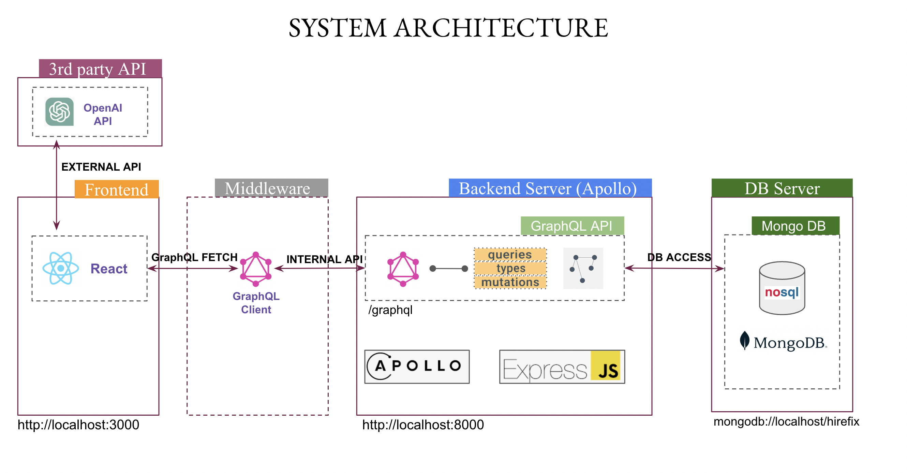
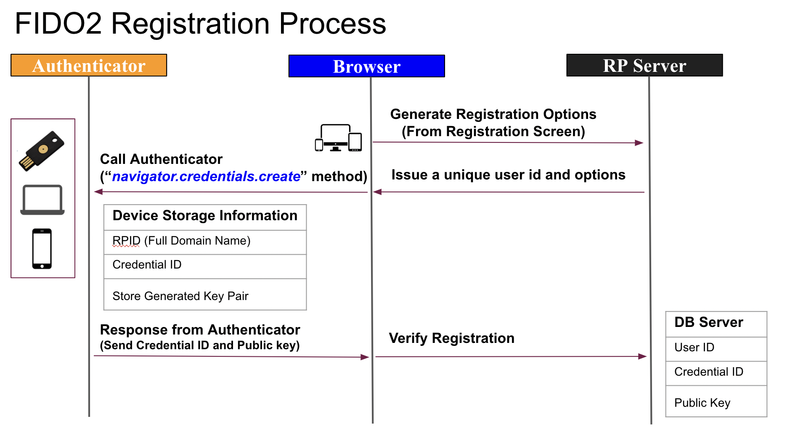
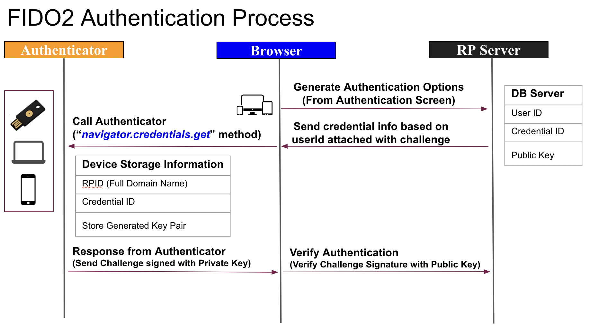

# My Portfolio

Regarding Graph QL part, please see the graphQL folder in detail.
Regarding Web authentication (passwordless) part, please see the webauthn folder in detail.

In terms of our group assignment @NUS, we are creating the C-to-C platform of home repair services. 
   

   
   

